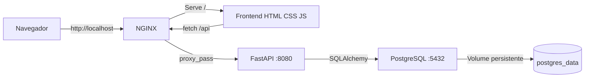

<div align="center">

# CineReview

Sistema de Filmes e Avaliacoes desenvolvido para a disciplina **Servicos de Redes para Internet**.


</div>

## Sobre o Projeto

O **CineReview** e uma aplicacao web conteinerizada para cadastrar filmes e registrar avaliacoes. O projeto foi desenvolvido para demonstrar orquestracao de servicos com Docker Compose, comunicacao entre containers, uso de variaveis de ambiente, persistencia com volume Docker e proxy reverso com NGINX.

Tema do grupo:

> Grupo 7: Sistema de Filmes e Avaliacoes

## Integrantes

- Bernard Rodrigues Moreira Andrade
- Maria Laura Barbosa Lourenco Cesar
- Emily Bedim Jorge Borges

## Stack Utilizada

| Camada | Tecnologia | Funcao |
| --- | --- | --- |
| Proxy e frontend | NGINX | Serve o frontend estatico e encaminha `/api` para o backend |
| Backend | FastAPI + Python | Disponibiliza a API REST e regras de CRUD |
| Banco de dados | PostgreSQL | Persiste filmes e avaliacoes |
| Orquestracao | Docker Compose | Sobe todos os servicos com um unico comando |
| Frontend | HTML, CSS e JavaScript | Interface simples consumindo a API por `/api` |

## Arquitetura

A aplicacao possui tres containers principais:

| Container | Responsabilidade | Exposto ao hospedeiro |
| --- | --- | --- |
| `nginx` | Frontend estatico e proxy reverso | Sim, portas `80` e `443` |
| `fastapi` | API interna na porta `8080` | Nao |
| `postgres` | Banco de dados PostgreSQL | Nao |

Rede Docker:

```text
netatividade01
```

Portas publicadas:

```text
80:8080
443:8443
```

Fluxo da aplicacao:



## Requisitos Atendidos

- [x] Aplicacao com containers `nginx`, `fastapi` e `postgres`.
- [x] NGINX como unico servico exposto ao hospedeiro.
- [x] Mapeamento de portas `80:8080` e `443:8443`.
- [x] Frontend estatico servido na raiz `/`.
- [x] Proxy reverso encaminhando `/api` para o FastAPI.
- [x] FastAPI executando internamente na porta `8080`.
- [x] PostgreSQL usando imagem oficial.
- [x] Usuario do banco definido como `postgres`.
- [x] Senha do banco definida por variavel de ambiente no `.env`.
- [x] Volume persistente para o PostgreSQL.
- [x] Rede Docker chamada `netatividade01`.
- [x] CRUD completo de filmes.
- [x] CRUD completo de avaliacoes.
- [x] Relacionamento entre filmes e avaliacoes.
- [x] README com instrucoes, rotas e comandos de teste.

## Entidades

### Filmes

| Campo | Tipo | Descricao |
| --- | --- | --- |
| `id` | Integer | Identificador unico |
| `titulo` | String | Titulo do filme |
| `diretor` | String | Diretor do filme |
| `genero` | String | Genero do filme |
| `ano` | Integer | Ano de lancamento |
| `sinopse` | Text | Resumo do filme |

### Avaliacoes

| Campo | Tipo | Descricao |
| --- | --- | --- |
| `id` | Integer | Identificador unico |
| `filme_id` | Integer | Chave estrangeira para `filmes.id` |
| `nome_avaliador` | String | Nome de quem avaliou |
| `nota` | Float | Nota de 0 a 10 |
| `comentario` | Text | Comentario da avaliacao |

Relacionamento:

- Um filme pode ter varias avaliacoes.
- Uma avaliacao pertence a exatamente um filme.
- Ao remover um filme, suas avaliacoes tambem sao removidas.

## Como Executar

Antes de executar, garanta que o Docker Desktop esteja aberto e funcionando.

Teste o Docker:

```bash
docker version
```

O resultado deve mostrar as secoes `Client` e `Server`.

Suba toda a aplicacao:

```bash
docker compose up --build
```

Acesse no navegador:

| Recurso | URL |
| --- | --- |
| Frontend | `http://localhost` |
| Frontend HTTPS | `https://localhost` |
| Documentacao da API | `http://localhost/api/docs` |
| Health check | `http://localhost/api/health` |

Observacao: o HTTPS usa certificado local autoassinado, entao o navegador pode exibir um aviso de seguranca.

## Variaveis de Ambiente

Arquivo `.env`:

```env
POSTGRES_PASSWORD=20241si003
POSTGRES_DB=cinereview
```

Arquivo `.env.example`:

```env
POSTGRES_PASSWORD=troque_esta_senha
POSTGRES_DB=cinereview
```

Na entrega da disciplina, a senha deve ser a matricula de um integrante do grupo, conforme solicitado na atividade.

## Rotas da API

### Filmes

| Metodo | Rota | Descricao |
| --- | --- | --- |
| `GET` | `/api/filmes` | Lista todos os filmes |
| `POST` | `/api/filmes` | Cadastra um novo filme |
| `GET` | `/api/filmes/{filme_id}` | Busca um filme pelo ID |
| `PUT` | `/api/filmes/{filme_id}` | Atualiza um filme |
| `DELETE` | `/api/filmes/{filme_id}` | Remove um filme |
| `GET` | `/api/filmes/{filme_id}/avaliacoes` | Lista avaliacoes de um filme |

### Avaliacoes

| Metodo | Rota | Descricao |
| --- | --- | --- |
| `GET` | `/api/avaliacoes` | Lista todas as avaliacoes |
| `GET` | `/api/avaliacoes?filme_id=1` | Lista avaliacoes filtrando por filme |
| `POST` | `/api/avaliacoes` | Cadastra uma nova avaliacao |
| `GET` | `/api/avaliacoes/{avaliacao_id}` | Busca uma avaliacao pelo ID |
| `PUT` | `/api/avaliacoes/{avaliacao_id}` | Atualiza uma avaliacao |
| `DELETE` | `/api/avaliacoes/{avaliacao_id}` | Remove uma avaliacao |

## Exemplos de Teste com curl

Health check:

```bash
curl.exe http://localhost/api/health
```

Criar um filme:

```bash
curl.exe -X POST http://localhost/api/filmes -H "Content-Type: application/json" -d "{\"titulo\":\"Matrix\",\"diretor\":\"Lana Wachowski e Lilly Wachowski\",\"genero\":\"Ficcao cientifica\",\"ano\":1999,\"sinopse\":\"Um hacker descobre a verdade sobre sua realidade.\"}"
```

Listar filmes:

```bash
curl.exe http://localhost/api/filmes
```

Criar uma avaliacao:

```bash
curl.exe -X POST http://localhost/api/avaliacoes -H "Content-Type: application/json" -d "{\"filme_id\":1,\"nome_avaliador\":\"Ana\",\"nota\":9.5,\"comentario\":\"Filme marcante e muito bem construido.\"}"
```

Listar avaliacoes de um filme:

```bash
curl.exe http://localhost/api/filmes/1/avaliacoes
```

Atualizar um filme:

```bash
curl.exe -X PUT http://localhost/api/filmes/1 -H "Content-Type: application/json" -d "{\"genero\":\"Acao e ficcao cientifica\"}"
```

Atualizar uma avaliacao:

```bash
curl.exe -X PUT http://localhost/api/avaliacoes/1 -H "Content-Type: application/json" -d "{\"nota\":10,\"comentario\":\"Continua excelente.\"}"
```

Remover uma avaliacao:

```bash
curl.exe -X DELETE http://localhost/api/avaliacoes/1
```

Remover um filme:

```bash
curl.exe -X DELETE http://localhost/api/filmes/1
```

## Comandos Uteis

Ver containers:

```bash
docker compose ps
```

Ver logs:

```bash
docker compose logs -f
```

Ver logs de um servico especifico:

```bash
docker compose logs fastapi
docker compose logs nginx
docker compose logs postgres
```

Parar a aplicacao mantendo os dados:

```bash
docker compose down
```

Parar a aplicacao apagando o volume do banco:

```bash
docker compose down -v
```

Entrar no PostgreSQL:

```bash
docker compose exec postgres psql -U postgres -d cinereview
```

## Estrutura do Projeto

```text
.
|-- backend/
|   |-- Dockerfile
|   |-- requirements.txt
|   `-- app/
|       |-- __init__.py
|       `-- main.py
|-- frontend/
|   |-- assets/
|   |   `-- cinereview-logo.svg
|   |-- app.js
|   |-- index.html
|   `-- styles.css
|-- nginx/
|   |-- Dockerfile
|   `-- default.conf
|-- .env
|-- .env.example
|-- docker-compose.yml
|-- GUIA_ESTUDO_APRESENTACAO.md
`-- README.md
```

## Como Explicar na Apresentacao

Resumo curto:

> O NGINX e a unica entrada da aplicacao. Ele serve o frontend em `/` e encaminha `/api` para o FastAPI. O FastAPI acessa o PostgreSQL pela rede Docker interna `netatividade01`, usando variaveis de ambiente. O PostgreSQL usa volume para persistir os dados.

Pontos principais para mostrar:

- `docker-compose.yml`: tres servicos, rede, volume e portas somente no NGINX.
- `nginx/default.conf`: regra de proxy reverso para `/api`.
- `backend/app/main.py`: modelos, schemas, rotas CRUD e relacionamento.
- `frontend/app.js`: chamadas `fetch` usando `/api`.
- `README.md`: comandos de execucao e exemplos de rotas.

## Observacoes

- O backend e o banco nao sao expostos ao hospedeiro.
- O frontend nao chama o FastAPI diretamente; ele chama `/api`.
- O NGINX resolve a comunicacao interna com `fastapi:8080`.
- O PostgreSQL persiste os dados no volume `postgres_data`.
- O guia `GUIA_ESTUDO_APRESENTACAO.md` contem perguntas e respostas para a entrevista individual.

